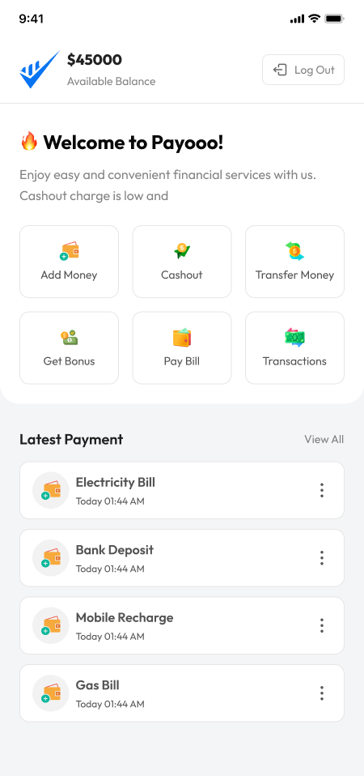
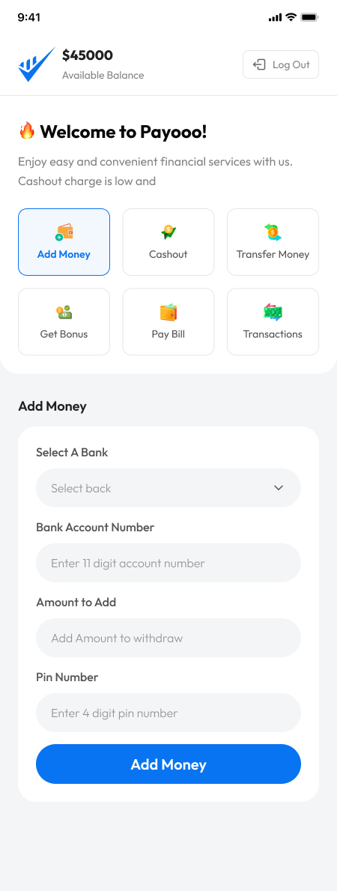
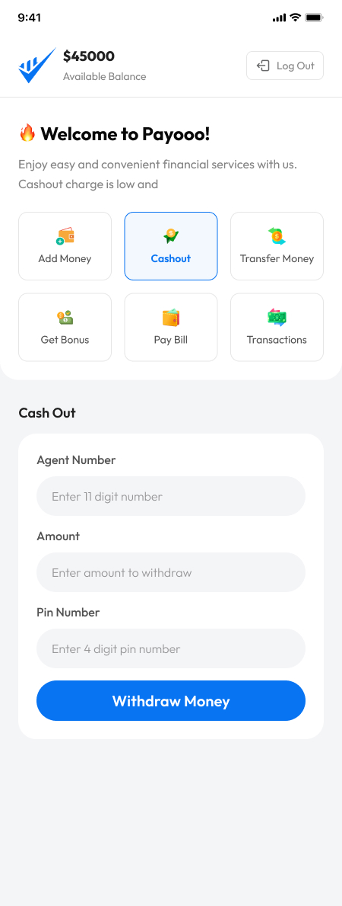
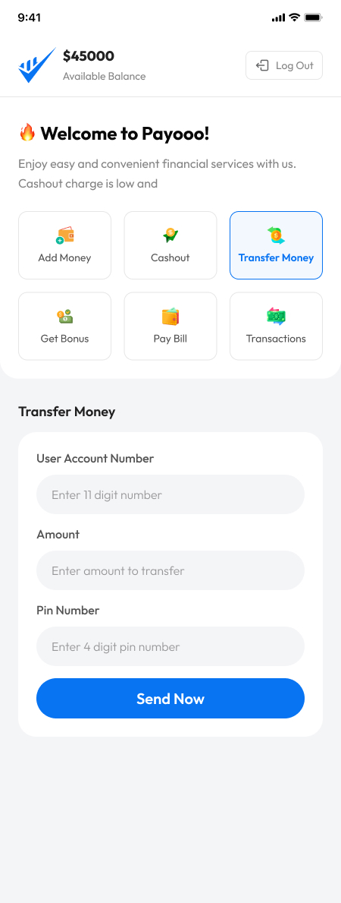
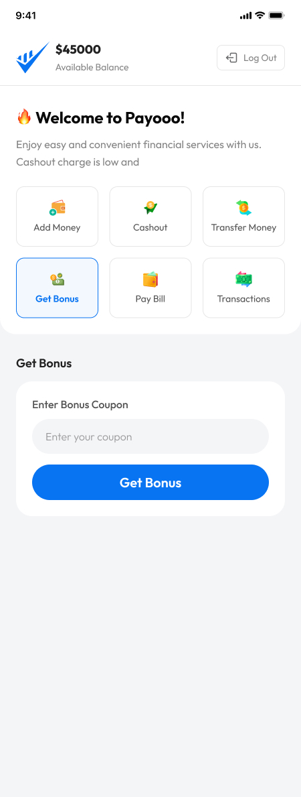
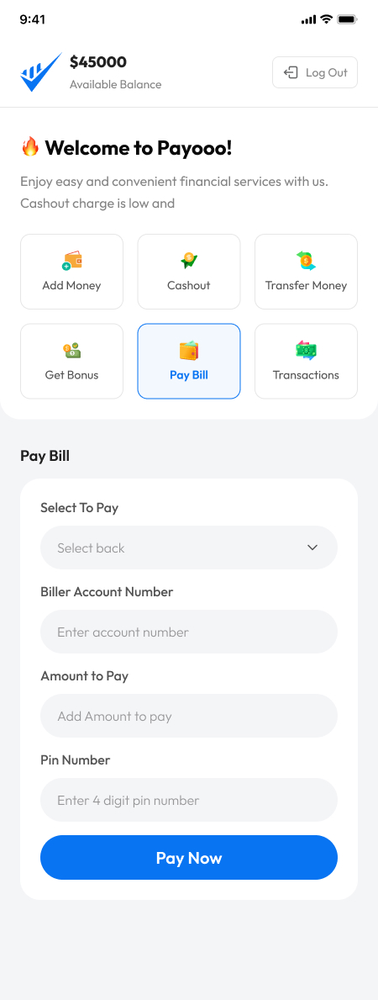
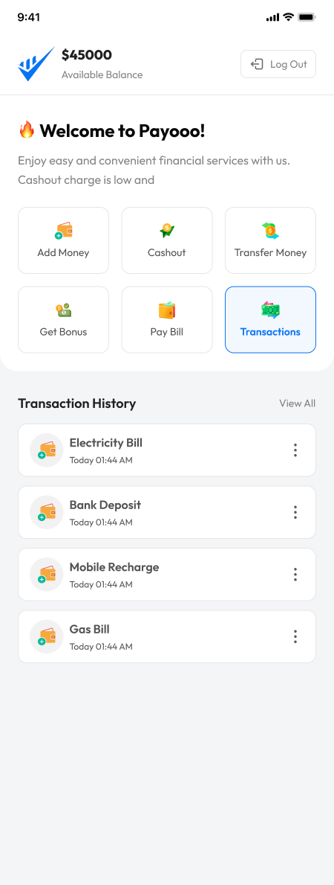

# Payoo


## Overview

Payoo is a demo mobile finance system for practicing JavaScript DOM manipulation.

## Design 

<br>


<br>


<br>


<br>


<br>


<br>



## Features

- Dynamic Web Application
- Responsive design
- Login system (demo)
- Add Money (demo)
- Cash Out (demo)
- Money Transfer (demo)
- Bonus (demo)
- Pay Bill (demo)
- Transaction History (demo)

## Tech Stack and packages

- Vanilla JavaScript 
- Vanilla CSS

## Installation

To get started with the project, follow these steps:

```sh
# Clone the repository
git clone https://github.com/mdsaifurrahman117/Mission-Developer-Assignment-08.git

# Navigate into the project directory
cd Payoo

# Open with code editor
code .
```

## Project Structure

```
Payoo/
│──├── assets/            # Static assets (assets, design, icons, etc.)
│   │   ├── design        # Application design
│   │   │   ├── add-money.jpg
│   │   │   ├── bonus.jpg
│   │   │   ├── cash-out.jpg
│   │   │   ├── home-page.jpg
│   │   │   ├── login-page.jpg
│   │   │   ├── money-transfer.jpg
│   │   │   ├── pay-bill.jpg
│   │   │   └── transaction.jpg
│   │   ├── icons         # icons
│   │   │   ├── add-money.png
│   │   │   ├── bonus.png
│   │   │   ├── cash-out.png
│   │   │   ├── money-transfer.png
│   │   │   ├── pay-bill.png
│   │   │   └── transaction.png
│   │   └── Logo-full.png # logo 
│   │   └── logo.png      # Favicon
│   └── scripts            # scripts folder
│   │   └── scripts.js
│   └── styles             # styles folder
│           └── styles.css
│── index.html            # Index html file
└── README.md          # Documentation
```

## Deployment

This project is deployed on GitHub pages.

- Live site : 

## Contact

For questions or issues, please reach out to [[saifurrahmansaif954@gmail.com](mailto\:saifurrahmansaif954@gmail.com)] or open an issue in the repository.

